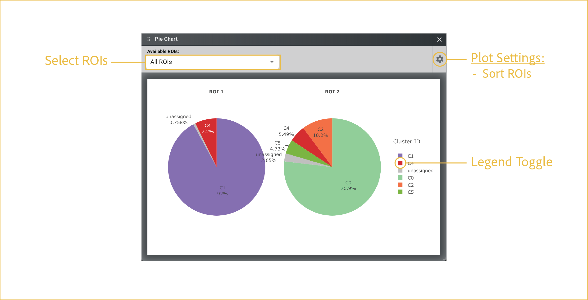

# pie chart

---

 

Learn how to summarize ROI cluster composition using pie charts.

## reference image

 

## features

A pie chart is most useful for showing the relative composition of each ROI across annotated clusters. When running on multiple ROIs, it provides a quick visual way to spot differences in cell type composition.

- <b><u>Select ROIs:</u></b>

    This drop down has a multiselect feature which allows you to choose which ROIs to display and compare. You can choose them one-at-a-time by checking each desired box, or you can **Select All**.

- <b><u>Plot Settings:</u></b>
    
    The settings menu changes structural aspects of the plot related to axes, colorbars, and labels. This menu is shared across all plots. For each plot, the options are specific to the type of plot that is being made. For barplots, the options are as follow:

    - **Sort ROIs:** Places all ROI in the order in which they were drawn.

- <b><u>Legend Toggle:</u></b>

    In the G4X Viewer, any time a legend is displayed, the points displayed can be modified by left clicking once or twice on a given legend element. This feature is shared across most interactable Plotly plots found in G4X outputs. 

    - `Single click:` Hides selected category. Multiple can be hidden at once. Single clicking again will unhide.
    - `Double click:` Hides all categories except for the selected group.

 

--8<-- "_core/_partials/end_cap.md"
