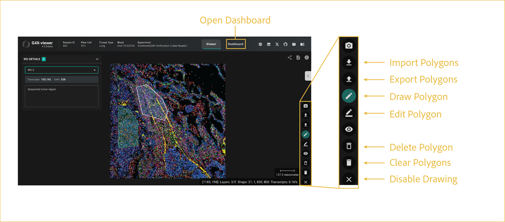

# ROI selection

---

 

Learn how to create and manipulate ROIs for dashboard analyses. If you're new to this process, start here.

## reference image

## getting started

In order to utilize the tools in the dashboard, you have to draw or import ROIs/Polygons that can be used for comparison and analysis. Some functions in the Viewer refer to ROIs as Polygons, but for all pages pertaining to Dashboard analysis we will refer to them as ROIs. 

Most of the explanation of where these UI elements lie is detailed in the image above and in the [on-screen controls](../viewer/on_screen_controls.md) page of the documentation. On this specific page, we will expand on the usage of the polygon manipulation tools and how they can be used for analysis in the Dashboard. All functions described on this page are found in the expanded, on-screen menu once Drawing Mode is enabled. Drawing Mode is enabled by clicking the **Draw Polygon** button, which will cause the button to turn teal.

 

### Creating ROIs

Everything below here assumes Drawing Mode is enabled.

To begin drawing an ROI, make sure the **Draw Polygon** button is highlighted in teal. Left click the image area to place a vertex. Each subsequent left click will refine the polygon shape and extent by adding another vertex. The polygon finalizes when you double click the start vertex. Upon closure of the shape, your polygon will be analyzed for cells, transcripts, and protein information stored within it. ROIs can be edited, imported, exported, and used for analysis. There is no limit to the number of ROIs that can be drawn.

### Editing ROIs

Once drawn, your ROIs are still editable. If you've drawn one that you later want to refine, you can go back into your data and add, delete, or move existing vertices using the **Edit Polygon** button in the polygon menu. Any time a change is made, the ROI will update and recalculate all transcripts and cells contained within it. For large changes, this may take a few seconds.

- **To add a vertex:** Hover over one of the boundary lines for your ROI. A small, red dot will appear. Click to place it, holding your left click and moving it to place it where you would like it to go.

- **To move a vertex:** Hover over one of the vertices on your ROI (the red dots). To move it, left click and hold, then move it to where you would like it to go, releasing the left click when you're happy with the location.

- **To delete a vertex:** Hover over one of the vertices on your ROI (the red dots). Once you've identified the one you want removed, left click it and it will disappear.

### Deleting ROIs

If you want to remove an ROI in its entirety, there are two buttons used to remove ROIs. They're both represented by trash bin icons, described below:

1. `Delete Polygon`: Deletes polygons one at a time by clicking on the one you wish to delete.

2. `Clear All Polygons`: Deletes all polygons at once.

### Importing and Exporting ROIs

If you want to use the same ROIs across samples, for serial sections or to compare a similar area in normal and disease tissues, you can use the Import/Export Polygons button to do this after you've drawn a set of ROIs you are happy with. 

- **Export Polygons:** This function has multiple modes. You can export as either a CSV or a JSON file, and each can be exported either with or without transcript data. Only JSON files (both with and without transcript data) can be used to reload polygons after the fact. 

    - `CSV files:` Contains list of vertex (X,Y) coordinates, ROI summary statistics, ROI metadata.
    - `JSON files:` Contains list of vertex (X,Y) coordinates, ROI metadata, and list of transcripts present with their position, cell id, and species.

- **Import Polygons:** This function can only import JSONs formatted in the same way as the **Export Polygon** JSON files. Inputs can be either with or without transcript data. Imported polygons will appear on the image after loaded is complete.

Once you're happy with the ROIs you've selected, it's time to move on to the Dashboard tab to generate plots. For details on plot types, see the plot-specific pages.

- [expression box chart](./expression_box_chart.md)
- [pie chart](./pie_chart.md)
- [expression bar chart](./expression_bar_chart.md)
- [heatmap chart](./expression_heatmap.md)

 

--8<-- "_core/_partials/end_cap.md"
