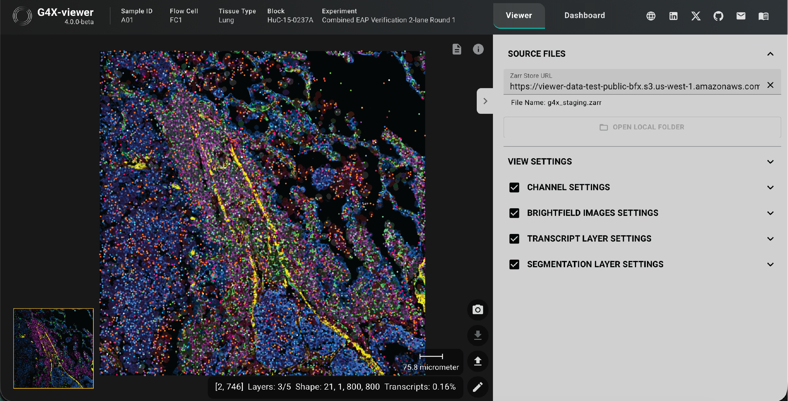

 
# :material-magnify: G4X-viewer
<a href="https://g4x-viewer.singulargenomics.com">g4x-viewer.singulargenomics.com</a>
 

#### Explore the G4X-Viewer

---

 

G4X-viewer is an advanced, open source project designed to visualize imaging data using modern web technologies. The project is continuously evolving to provide an intuitive and flexible interface for the analysis and presentation of complex datasets. Inspired by the [Viv](https://github.com/hms-dbmi/viv) library, our goal is to push the boundaries of interactive data visualization in web applications.

The G4X-viewer enables you to visualize and interact with your [G4X data](https://docs.singulargenomics.com/g4x_data/g4x_output/) in a user-friendly interface. With it, you can begin to understand spatial patterning of your tissues, take screenshots of specific features of interest, subsample your data, and gain insights into your specific biological system.

We provide a web-based version of the G4X-viewer that can be accessed through our [website](https://g4x-viewer.singulargenomics.com). For users who want to use it locally, we also provide installation instructions on our [Github](https://github.com/Singular-Genomics/G4X-viewer).

!!! tip
    Older data sets may require use of our [legacy viewer](https://g4x-viewer.legacy.singulargenomics.com) if the data was generated before December 2025. In this legacy viewer, many analysis features will be unavailable.
 

### [viewer](viewer/index.md)
---

Navigate to the [viewer](viewer/index.md) page to learn how to interact with the G4X-viewer's core functions. These pages comprehensively go through all interactable elements on the viewer tab and how to use them, organized by which modalities and image layers are being manipulated.

The viewer pages include:

+ uploading source files
+ on-screen controls
+ protein layer controls
+ fH&E layer controls
+ transcript layer controls
+ segmentation layer controls
+ UMAP cell filter
+ flow cytometry cell filter

 

### [dashboard](dashboard/index.md)
---

Navigate to the [dashboard](dashboard/index.md) page to learn how to use the dashboard tab to perform basic analysis on your data without ever leaving the G4X-viewer. All dashboard features are instanced with your viewer window to allow you to seamlessly jump between looking at your data and performing rapid analysis.

The dashboard pages include:

+ ROI selection guide
+ expression box charts
+ pie charts
+ expression bar charts
+ heatmap charts

 

### [resources](resources.md)
---

Please navigate to the G4X-viewer [resources](./resources.md) to help you leverage the suite of tools available in the G4X-viewer

 

### support
---

Got feedback or ideas for additional tutorials?  
:material-arrow-right-thin: drop us a note at [care@singulargenomics.com](mailto:care@singulargenomics.com).  

Found a bug or want to report another problem regarding G4X-viewer?  
:material-arrow-right-thin: please file a new issue on the G4X-viewer [issue tracker](https://github.com/Singular-Genomics/G4X-viewer/issues)  

Want to get involved and add new features?  
:material-arrow-right-thin: check out how to [contribute](https://github.com/Singular-Genomics/G4X-viewer?tab=contributing-ov-file#readme) 

--8<-- "_core/_partials/end_cap.md"
