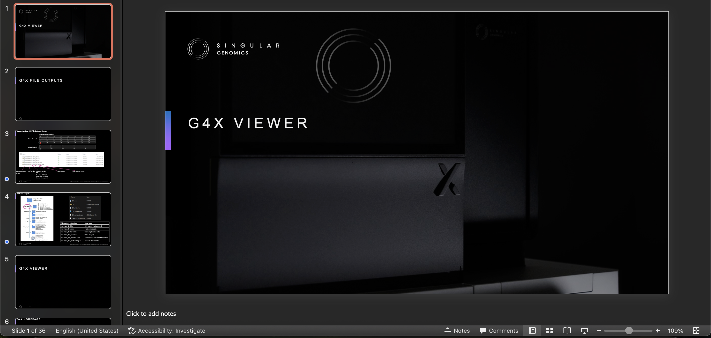

# G4X Viewer Resources

The G4X Viewer is designed to be intuitive and user-friendly, but we understand that you may need additional help to get the most out of it. Below are some resources to assist you in using the G4X Viewer effectively:

## G4X Viewer Video Tutorial
---

A step-by-step video walkthrough to utilizing the G4X Viewer to explore your G4X data outputs, from filtering and subsampling, to saving and sharing your visualizations. This video is a great starting point for new users.

 

## G4X Viewer Introductary Slides
---

A slide deck to walk you through the core functions of the G4X Viewer, including how to load your data, navigate interfaces, and a set of helpful tips and tricks to make sure you know exactly how to get the most out of the G4X Viewer.

 

--8<-- "_core/_partials/end_cap.md"
