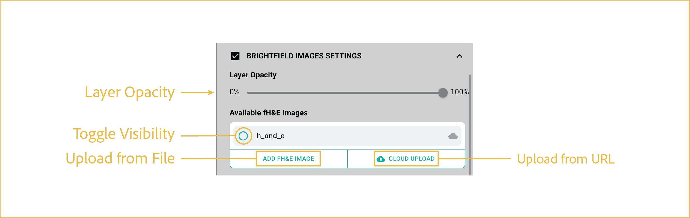

# fH&E layer

---

 

This section describes how to load, display, and adjust the fH&E image layer.

## reference image

 

These controls manage fH&E visibility, opacity, and optional image upload.

## features

- <b><u>Layer Opacity:</u></b>

      Adjusts the transparency of the fH&E image layer.

- <b><u>Toggle Visibility:</u></b>

      Shows or hides the fH&E image.

- <b><u>Upload Data:</u></b>

      These controls are used to load an fH&E image into the viewer. For Zarr-based datasets, the fH&E image is typically loaded automatically.

      - **Upload from Cloud:** Select an image file from a cloud-based source, such as an Amazon S3 bucket.
      - **Upload from File:** Select an image file from a locally accessible storage device.

 

--8<-- "_core/_partials/end_cap.md"
