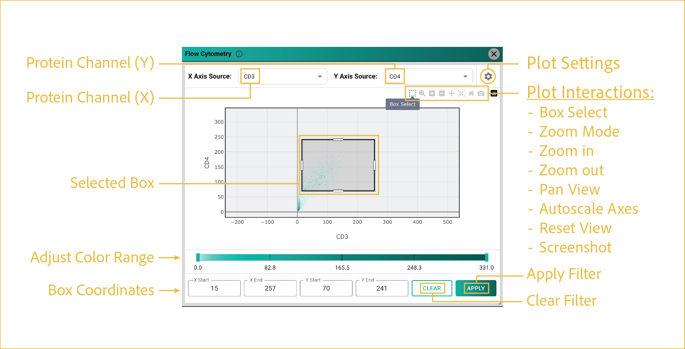

# flow cytometry filter
---

 
This section focuses on uploading your data and toggling which layers you want visible at any given time.

## reference image

 

## features

- <b><u>Protein Channel Selection:</u></b>

      Select two protein channels to compare cell-level protein intensity values.

      Protein intensity is calculated using the mean intensity across all pixels within each cell. The same protein channel cannot be selected for both axes.

- <b><u>Plot Settings:</u></b>

      Access plot customization options by clicking the gear icon in the upper-right corner of the window.

      Available settings include:

      - Graph type
      - Color scale
      - Number of bins
      - Subsampling
      - Point size
      - Logarithmic scaling
      - Additional plot display options

      You can also manually adjust the color scaling range using the sliders at the bottom of the window to exclude cells above or below specified values from the visualization.

- <b><u>Plot Interaction Menu:</u></b>

      This menu provides a variety of standard Plotly interactions, including:

      - Downloading the plot
      - Zooming in and out
      - Zooming to a selected area
      - Panning across the plot
      - Selecting a region of interest (ROI)
      - Resetting the plot axes

      For filtering, the most important tool is **Box Select**, highlighted in the reference image. This tool is used to select a subpopulation of cells for downstream filtering.

- <b><u>Select ROI:</u></b>

      After selecting the **Box Select** tool, navigate to the desired area of the plot and draw a box around the cells you would like to filter.

      The selection box will remain visible until a new selection is made or the filter is cleared. The X- and Y-axis boundaries of the selected region are displayed at the bottom of the plot.

- <b><u>Apply/Clear Filter:</u></b>

      Once you are satisfied with your ROI selection, click **APPLY** to display the selected cells in the main G4X Viewer window.

      The filter remains active until you reopen the Flow Cytometry Filter tool and click **CLEAR**. This filter behaves like any other segmentation filter and can be combined with other viewer filtering features.

 
--8<-- "_core/_partials/end_cap.md"
