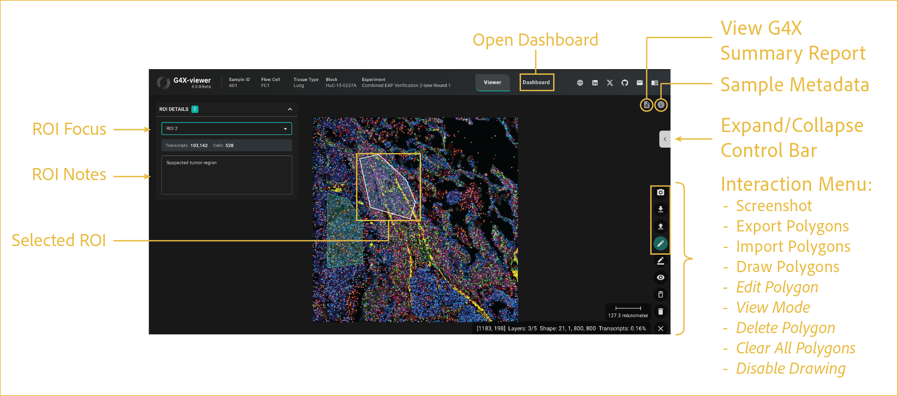

# on-screen controls

---

 

This section describes the buttons and interactive tools that are available directly within the viewer window. Additional information about many of these features can be found in the [dashboard](../dashboard/index.md) section.

## reference image

 

## features

- <b><u>Open Dashboard:</u></b>

    Opens the [dashboard](../dashboard/index.md) feature for analysis of user-selected ROIs. Changing between **Dashboard** and **Viewer** does not open a new instance and shares a save state between the two tabs.

- <b><u>View G4X Summary Report:</u></b>

    Opens the G4X Sample Summary Report HTML report. This report details core run statistics and information to help rapidly QC your data. This report is also found in the root directory for each sample. For more details on standard output files, see [G4X data](https://docs.singulargenomics.com/g4x_data/).

- <b><u>Sample Metadata:</u></b>

    Opens a pane that displayed details metadata for the run, pulled from sample sheet, sample-specific metadata, and more. All of this data is found in the standard output files, though not all in the same place. For more details on standard output files, see [G4X data](https://docs.singulargenomics.com/g4x_data/).

- <b><u>Expand/Collapse Control Bar:</u></b>

      Expands/Collapses the side panel for controlling display settings described in all other sections.

- <b><u>Interaction Menu:</u></b>

    This menu is displayed by default with only the elements shown in the gold box. All elements from **Edit Polygons** onward appear once you have toggled Drawing Mode by clicking the **Draw Polygon** button.

    - **Screenshot:** Capture screenshots directly from the viewer and save them to your local device. Screenshots include only the current viewing area and exclude viewer interface elements such as side panels, menus, and buttons.

    - **Export/Import Polygons:** Import or export polygons and their associated metadata. Exported files can include polygon vertices, metadata, and transcript contents. Supported export formats include **JSON** and **CSV**. Exported polygon coordinates can be imported later to restore previously saved ROIs using **JSON** files only.

    - **Draw Polygon (ROI Selection):** Create custom regions of interest (ROIs) for analysis and export. There is no limit to the number of ROIs that can be created. Once completed, the ROI is automatically analyzed for the cells, transcripts, and protein intensity contained within its boundaries. Polygons can be edited, imported, exported, and used for downstream analysis.

        To draw a Polygon/ROI:

        1. Click **Draw Polygon**. The menu will expand.
        2. Left-click within the image to place the first vertex.
        3. Continue left-clicking to add additional vertices and refine the polygon shape.
        4. Double-click the starting vertex to close and finalize the Polygon.

    - **Edit Polygon:** Edit the vertices of the polygons present in your current Viewer instance.

    - **View Mode:** Hides on-screen labels for polygons and allows panning and zooming without visual obstructions.

    - **Delete Polygon:** Allows you to delete polygons by clicking anywhere within their on-screen area.

    - **Clear All Polygons:** Deletes all currently drawn polygons.

    - **Disable Drawing:** Disables drawing mode and collapses the menu back to the first four elements.

!!! tip "Multi-tissue Blocks (TMA-like Samples)"

    ROI selection is particularly useful for samples containing multiple independent tissue regions, such as tissue microarrays (TMAs).

    Individual tissue punches can be outlined separately, allowing independent export of transcripts and cell IDs for downstream analysis.

- <b><u>ROI Focus:</u></b>

    This menu appears once one or more Polygons are drawn. Here, you can select an ROI and see statistics about your selected ROI.

- <b><u>ROI Notes:</u></b>

    This section allows you to add notes about each ROI. For example, if you believe it to be a tumor or normal region of tissue, you could make a note of that or other pathologist assessments here.

- <b><u>Selected ROI:</u></b>

    The selected ROI is shown on screen in this manner with a white outline to visually indicate which one is being references above.

 

--8<-- "_core/_partials/end_cap.md"