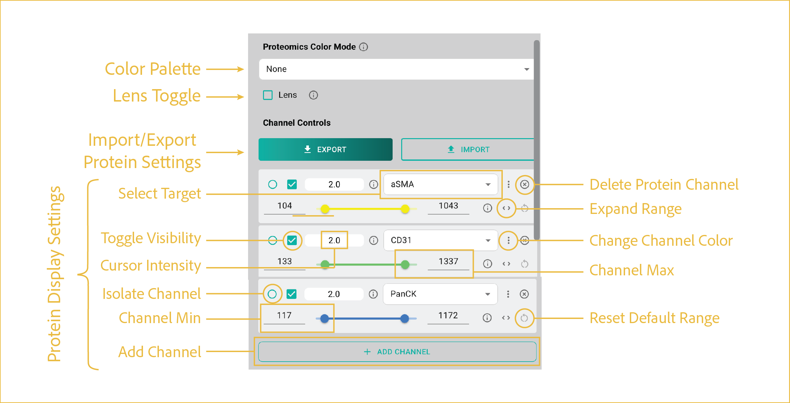

# protein layer
---

 
This first section focuses on uploading your data and toggling which layers you want visible at any given time.

## reference image

 

## features

This section explains the functions to manipulate and change the protein layer visualizations.

<ol class="viewer-feature-list">
  <li><strong>Protein Color Palette</strong>
  This drop down allows you to select the color palette to be used for the protein images (from standard plotly palettes).
   </li>

  <li><strong>Overview Image Toggle</strong>
  This toggles the visibility of the overview image window in the bottom left corner of your viewer instance. It displays a zoomed out perspective of the sample with a red box surrounding the current boundaries of your screen on the sample.
   </li>

  <li><strong>Lens Tool</strong>
  The lens tool is a toggle that, once enabled, will open up a pane to allow you to select a protein channel. Once selected, it allows you to isolate your selected protein channel and visualize it in color while all other active protein channels are grayed out within the area of the lens. The lens will follow your cursor until you toggled off.
   </li>

  <li><strong>Import/Export Protein Settings</strong>
  This setting allows the import and export of all settings pertaining to your proteins. Typically, we recommend finding the settings you like, then exporting and saving them so that you can use them on all samples going forward. To import, click the button and navigate to the JSON file you've saved on your PC. To export, set up with the parameters/settings that you like, then click export, choosing a save location and name on your PC.
   </li>

  <li><strong>Protein Channel Settings</strong>
  
When visualizing proteins, there are a number of features to turn to enable you to visualize and interpret your data in exactly the way you want:

    <ul>
      <li><code>Channel Toggle</code>: This is a check box in the top left of the channel settings, turns the channel on and off entirely</li>
      <li><code>Protein Channel</code>: Dropdown for selection of which protein channel to visualize</li>
      <li><code>Color Selection</code>: Click the three vertical dots next to the protein channel dropdown to select a color to use</li>
      <li><code>Current Position Intensity</code>: Displayed as a floating point value below the channel selection pane. Lists the intensity of your cursor's current location for the specified protein channel (displays all channels simultaneously)</li>
      <li><code>Set Protein Min/Max</code>: Can be adjusted by manually typing in a value or using the slider at the bottom of the protein channel settings</li>
      <li><code>Isolate Protein Channel</code>: This is a check box near the Channel Toggle that allows you to turn off all channels except for your specified one</li>
      <li><code>Add/Remove Channel</code>: To add a protein channel, click "+ Add Channel"  at the bottom of the pane. To remove a channel, click the "x" button on the top right of the individual protein channel window.</li>
    </ul>
   </li>
</ol>

