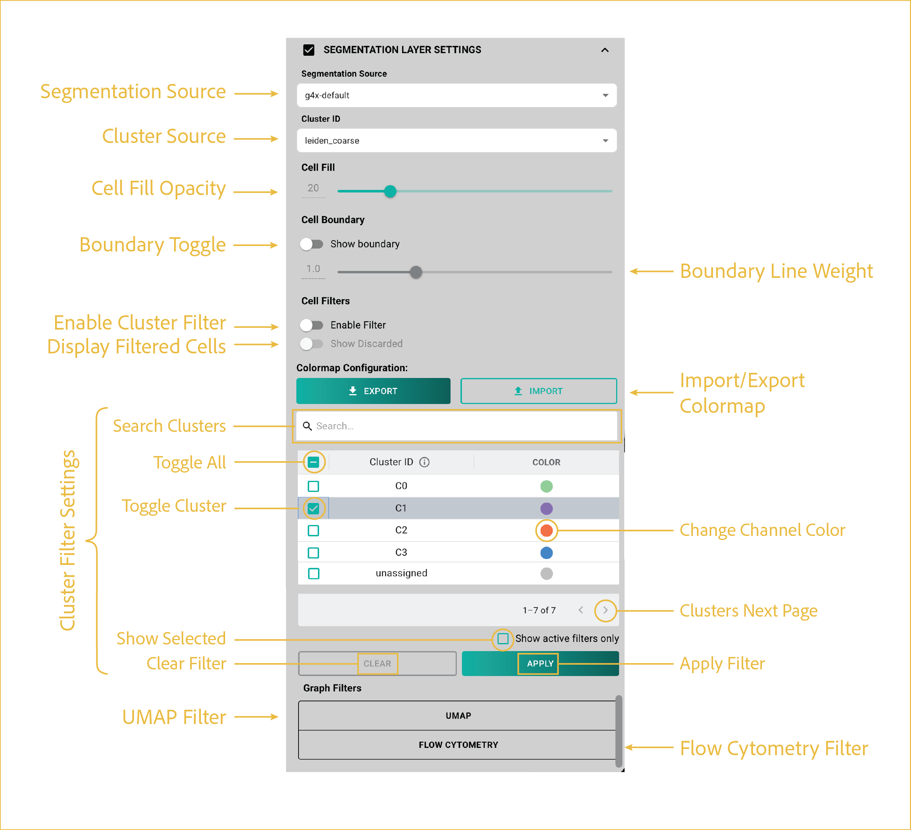

# segmentation layer
---

 
This first section focuses on uploading your data and toggling which layers you want visible at any given time.

## reference image

 

## features

This section explains the functions to manipulate and change the segmentation layer visualizations. The segmentation masks displayed are approximations of the pixel-level segmentation performed by Cellpose, and are displayed as a set of vertices. As such, they will differ slightly from the true segmentation masks used for analysis.

<ol class="viewer-feature-list">
  <li><strong>Cell Fill Toggle/Opacity</strong>
  Using the toggle, you can turn on the fill on the cell masks (on by default). If turned off, only outlines are present. When enabled, the slider enables control of opacity, where 0 means transparent and 100 means opaque.
   </li>

  <li><strong>Segmentation Filter Toggles</strong>
  These "Enable Filter" toggles enable you to turn on and off any cell-level filtering that you might choose to do, including cluster ID(s), UMAP, and flow cytometry filtering. When a filter is applied, you gain access to the "Show Discarded" toggle, which enables you to add back all data that was filtered as white cells, i.e. dissociated from their assigned clusters.
   </li>

  <li><strong>Import/Export Segmentation Settings</strong>
  This setting allows the import and export of all settings pertaining to your segmentation colormaps. To import, click the button and navigate to the JSON file you've saved on your PC. To export, set up with the parameters/settings that you like, then click export, choosing a save location and name on your PC.
   </li>

  <li><strong>Segmentation Filter Controls</strong>
  Filtering of cells can be done either by scrolling through the ordered list or by using the search bar. Cells labeled as -1 were not assigned a cluster, often due to filtering. To add or remove a cell cluster from your filter list, click the left-hand check box. Checked clusters will display when the "APPLY" button is clicked or the "Enable Filter" toggle is turned on. Clearing the filter can be done with the "CLEAR" button. Clicking "Show active filters only" will display only selected clusters, hiding all non-selected ones. 
   </li>

  <li><strong>Open UMAP Filter Panel</strong>
  See <a href="./usage/#umap-cell-filtering">UMAP cell filtering</a> for more details.
   </li>
  <li><strong>Open Flow Cytometry Filter Panel</strong>
  See <a href="./usage/#flow-cytometry-cell-filtering">Flow cytometry cell filtering</a> for more details.
   
  </li>
</ol>

