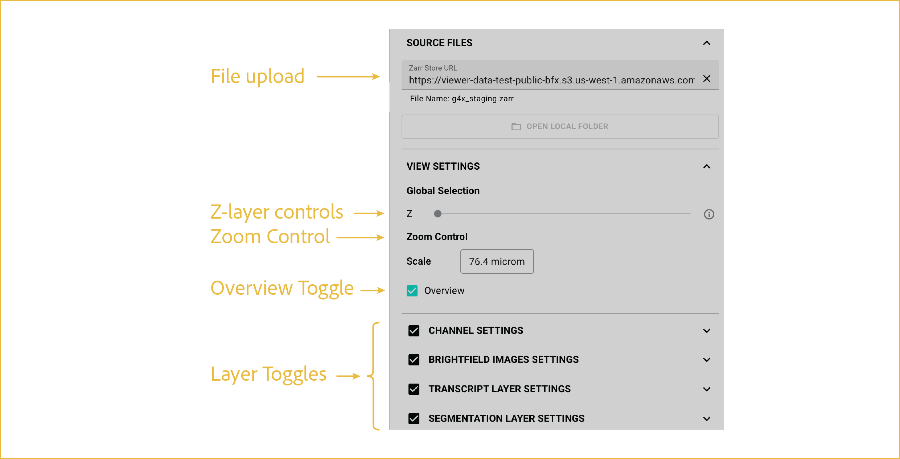

# G4X-viewer source files
---

 
This first section focuses on uploading your data and toggling which layers you want visible at any given time.

## reference image

 

## features

<ol class="viewer-feature-list">
  <li><strong>Viewer File Upload</strong>
    The File Upload section of the G4X Viewer is where you will want to start. Depending upon the version that you are using, you'll have either a single file upload (Zarr, coming with Version 4.0.0) or a multi-file upload that utilizes files directly from the 
    <a href="https://docs.singulargenomics.com/g4x_data/output_files/g4x_viewer/">g4x_viewer</a> 
    folder of your sample output. 

    
Each file contains one of the layers of the G4X assay:

    <ul>
      <li><code>&lt;sample_id&gt;.ome.tiff</code>: contains all protein image in a composite image</li>
      <li><code>&lt;sample_id&gt;_HE.ome.tiff</code>: contains the fH&amp;E image</li>
      <li><code>&lt;sample_id&gt;.bin</code>: contains the vertices of the segmentation mask</li>
      <li><code>&lt;sample_id&gt;.tar</code>: contains transcript locations for the sample</li>
      <li><code>&lt;sample_id&gt;_run_metadata.json</code>: contains sample and run metadata</li>
    </ul>
   
  </li>

  <li><strong>T- and Z-Slice Control</strong>
  If you upload a composite time course (T) or multi-level image (Z) with multiple stacked planes, this allows the viewer to jump between those image layers seamlessly. In typical G4X data, these features will be inaccessible and fixed to a single Z plane and time point. 
   
  </li>

  <li><strong>Image scaling</strong>
  Here you can precisely set the image scale by manually inputting a distance scale for the scale bar in the bottom right of the viewer window. This value will also autoscale as you zoom in and our of the image.
   
  </li>

  <li><strong>Layer Toggles</strong>
  These layer toggles allow you to turn on and off both segmentation and transcript layers. The protein layer is always on, as it is used as the base upon which other images are aligned and displayed.
   </li>
</ol>

