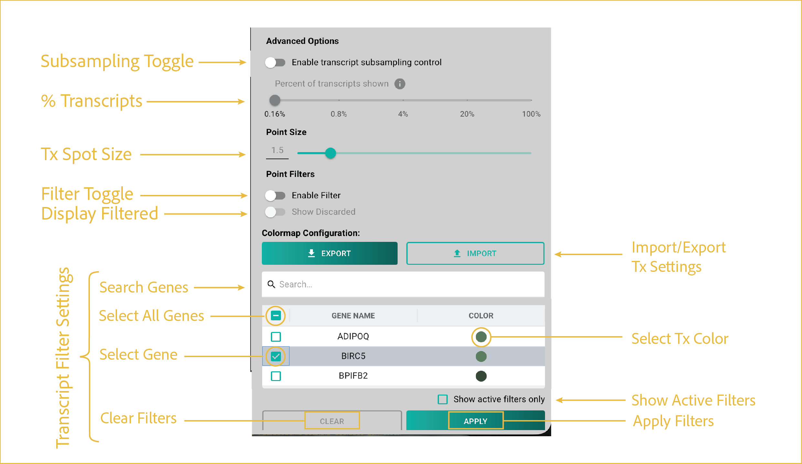

# transcript layer
---

 
This first section focuses on uploading your data and toggling which layers you want visible at any given time.

## reference image

## Features

- <b><u>Transcript Sub-sampling Controls:</u></b>

      Most G4X datasets contain more than one million transcripts. Transcript sub-sampling is used to reduce rendering load and maintain viewer responsiveness on standard desktop computers.

      By default, the G4X Viewer automatically adjusts transcript density as you zoom and pan throughout the image.

      Two controls are available for manual management of transcript rendering:

      - **Manual Sub-sampling Toggle:** Enables manual control of transcript display density instead of automatic dynamic sub-sampling.
      - **Display Percentage Slider:** Adjusts the percentage of displayed transcripts from **0.16%** to **100%**.

      When manual control is enabled, a warning is displayed indicating that rendering large numbers of transcripts may cause browser instability or crashes.

      We recommend keeping the display percentage below **20%** unless transcript display has already been restricted to a subset of transcript species.

- <b><u>Edit Point Size:</u></b>

      Adjusts the size of transcript markers displayed in the viewer.

      Point size can be modified by entering a value directly into the text field or by using the slider control. Changes are applied to all currently displayed transcripts.

- <b><u>Transcript Filter Toggles:</u></b>

      Controls whether transcript filtering is applied to the viewer.

      - **Enable Filters:** Activates or disables the transcript filters configured in the Transcript Filter Controls section.
      - **Show Discarded:** Displays filtered transcripts as white markers, allowing you to visualize transcripts that have been excluded by the current filter settings.

- <b><u>Import/Export Transcript Settings:</u></b>

      Import or export transcript visualization and filtering settings.

      Exported settings include:

      - Transcript color mappings
      - Selected transcript species
      - Filter configurations

      - **Import:** Click the button and select a previously saved JSON configuration file.
      - **Export:** Configure transcript settings as desired, then click **Export** and choose a save location and filename.

- <b><u>Transcript Filter Controls:</u></b>

      Filter transcripts by gene or transcript species using either the searchable list or by browsing the alphabetized transcript list.

      - Use the search bar to quickly locate specific genes.
      - Select or deselect transcript species using the checkbox next to each entry.
      - Click **APPLY** or enable the filter toggle to display only the selected transcript species.
      - Click **CLEAR** to remove all transcript selections and reset the filter.
      - Enable **Show Active Filters Only** to display only selected transcript species while hiding all others.

 

--8<-- "_core/_partials/end_cap.md"