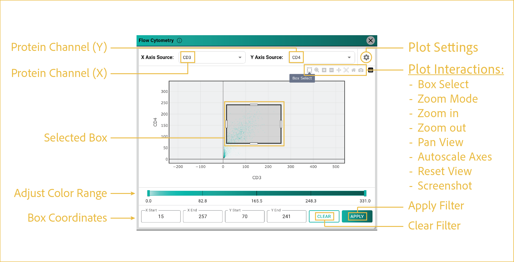

# flow cytometry filter

---

 

This section describes how to use the flow cytometry filtering tool to identify and visualize cell populations based on protein expression distributions.

## reference image

 

These controls configure the flow cytometry plot and apply selected protein-expression populations back to the main viewer.

## features

- <b><u>Protein Channel (X/Y):</u></b>

      Select two protein channels to compare cell-level protein intensity values.

      Protein intensity is calculated using the mean intensity across all pixels within each cell. The same protein channel cannot be selected for both axes.

- <b><u>Plot Settings:</u></b>

      You can access plot customization options by clicking the gear icon in the upper-right corner of the window. Available settings include:

      - Graph type
      - Color scale
      - Number of bins
      - Subsampling
      - Point size
      - Logarithmic scaling
      - Additional plot display options

- <b><u>Plot Interactions:</u></b>

      This menu provides standard Plotly interactions. For filtering, the most important tool is **Box Select**, highlighted in the reference image. Use this tool to select a subpopulation of cells for downstream filtering.

      - **Box Select:** Selects cells to filter for segmentation display.
      - **Zoom Mode:** Allows dynamic scrolling to change the plot zoom level.
      - **Zoom In:** Zooms in at set intervals.
      - **Zoom Out:** Zooms out at set intervals.
      - **Pan View:** Allows panning around the plot with your cursor.
      - **Autoscale Axes:** Autoscales axes to display all points in the viewing area.
      - **Reset View:** Returns to the default plot view.
      - **Screenshot:** Captures the displayed plot area without tools or other UI elements.

- <b><u>Selected Box:</u></b>

      After selecting the **Box Select** tool, left-click and drag to create a box around the cells you want to filter. This display shows an example selection on the flow cytometry plot.

- <b><u>Box Coordinates:</u></b>

      These values describe the X and Y ranges of the box used for the filter. You can manually update these values if needed.

- <b><u>Apply/Clear Filter:</u></b>

      Once you are satisfied with your box selection, click **APPLY** to display the selected cells in the main viewer window.

      The filter remains active until you reopen the Flow Cytometry Filter tool and click **CLEAR**. Flow cytometry filtering behaves like other segmentation filters and can be combined with other viewer filtering features.

 

--8<-- "_core/_partials/end_cap.md"
