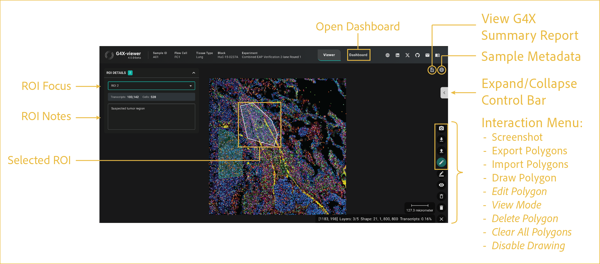

# on-screen controls

---

 

This section describes how to use the viewer's on-screen tools, including ROI selection, screenshot capture, polygon management, and other interactive controls. Additional information about many of these features can be found in the [dashboard](../dashboard/index.md) section.

## reference image

 

These controls sit directly in the viewer window and support dashboard access, ROI drawing, screenshot capture, and polygon management.

## features

- <b><u>Open Dashboard:</u></b>

    Opens the [dashboard](../dashboard/index.md) for analysis of user-selected ROIs. Switching between **Dashboard** and **Viewer** keeps the same session and shared save state.

- <b><u>View G4X Summary Report:</u></b>

    Opens the G4X Sample Summary Report HTML file. This report details core run statistics and information to help you assess data quality. The report is also available in the root directory for each sample. For more details on standard output files, see [G4X data](https://docs.singulargenomics.com/g4x_data/).

- <b><u>Sample Metadata:</u></b>

    Opens a pane that displays run metadata from the sample sheet, sample-specific metadata, and other standard output files. For more details on standard output files, see [G4X data](https://docs.singulargenomics.com/g4x_data/).

- <b><u>Expand/Collapse Control Bar:</u></b>

      Expands or collapses the side panel used to control the display settings described in the other usage sections.

- <b><u>Interaction Menu:</u></b>

    By default, this menu displays only the elements shown in the gold box. All elements from **Edit Polygon** onward appear after you enable drawing mode by clicking **Draw Polygon**.

    - **Screenshot:** Capture screenshots directly from the viewer and save them to your local device. Screenshots include only the current viewing area and exclude viewer interface elements such as side panels, menus, and buttons.

    - **Export/Import Polygons:** Import or export polygons and their associated metadata. Exported files can include polygon vertices, metadata, and transcript contents. Supported export formats include **JSON** and **CSV**. Exported polygon coordinates can be imported later to restore previously saved ROIs from **JSON** files.

    - **Draw Polygon (ROI Selection):** Create custom regions of interest (ROIs) for analysis and export. There is no limit to the number of ROIs that can be created. Once completed, the ROI is automatically analyzed for the cells, transcripts, and protein intensity contained within its boundaries. Polygons can be edited, imported, exported, and used for downstream analysis.

        To draw a polygon ROI:

        1. Click **Draw Polygon**. The menu will expand.
        2. Left-click within the image to place the first vertex.
        3. Continue left-clicking to add additional vertices and refine the polygon shape.
        4. Double-click the starting vertex to close and finalize the polygon.

    - **Edit Polygon:** Edit vertices for polygons in the current viewer instance.

    - **View Mode:** Hides on-screen labels for polygons and allows panning and zooming without visual obstructions.

    - **Delete Polygon:** Deletes polygons when you click anywhere within their on-screen area.

    - **Clear All Polygons:** Deletes all currently drawn polygons.

    - **Disable Drawing:** Disables drawing mode and collapses the menu back to the first four elements.

    !!! tip "Multi-tissue blocks (TMA-like samples)"
        ROI selection is particularly useful for samples containing multiple independent tissue regions, such as tissue microarrays (TMAs).

        Individual tissue punches can be outlined separately, allowing independent export of transcripts and cell IDs for downstream analysis.

- <b><u>ROI Focus:</u></b>

    This menu appears after one or more polygons are drawn. Use it to select an ROI and view statistics for the selected ROI.

- <b><u>ROI Notes:</u></b>

    This section allows you to add notes about each ROI, such as tumor status, normal tissue status, or other pathology assessments.

- <b><u>Selected ROI:</u></b>

    The selected ROI is shown on screen with a white outline to indicate which ROI is active in the controls above.

 

--8<-- "_core/_partials/end_cap.md"
