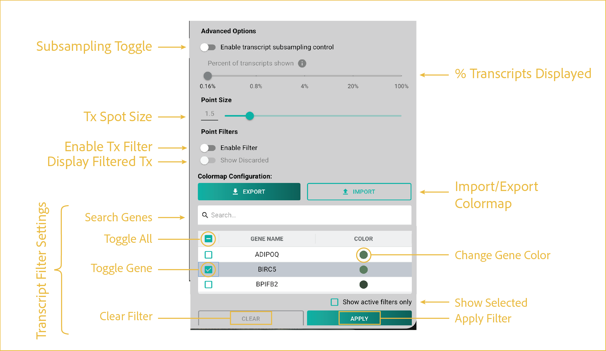

# transcript layer

---

 

This section describes how to customize transcript visualization, including transcript display density, color settings, filtering options, and transcript-specific controls.

## reference image

These controls balance transcript rendering performance with transcript display and filtering options.

## features

- <b><u>Subsampling Toggle:</u></b>

      Most G4X datasets contain more than 100 million transcripts. Transcript subsampling reduces rendering load and helps maintain viewer responsiveness on standard desktop computers. By default, the G4X Viewer automatically adjusts transcript density as you zoom and pan throughout the image for responsive exploration of your data. This toggle allows you to manually adjust the displayed transcript percentage.

- <b><u>% Transcripts Displayed:</u></b>
      
      Adjusts the percentage of displayed transcripts from **0.16%** to **100%**. When manual control is enabled, a warning is displayed indicating that rendering large numbers of transcripts may cause browser instability or crashes.

      We recommend keeping the display percentage below **20%** unless transcript display has already been restricted to a subset of transcript species.

- <b><u>Tx Spot Size:</u></b>

      Adjusts the size of transcript markers displayed in the viewer. Point size can be modified by entering a value directly into the text field or by using the slider control. Changes are applied to all displayed transcripts.

- <b><u>Enable Tx Filter:</u></b>

      Enables or disables the filter specified in the **Transcript Filter Settings** section.

- <b><u>Display Filtered Tx:</u></b>

      Shows or hides transcript species specified by the filters below. The **Display Filtered Tx** option is available only when a filter is actively applied to the image.

- <b><u>Import/Export Colormap:</u></b>

      Import or export transcript visualization settings and colormap configurations.

      - **Import:** Click the button and select a previously saved JSON configuration file.
      - **Export:** Configure the transcript settings as desired, then click **Export** and choose a save location and filename.

- <b><u>Transcript Filter Settings:</u></b>

      These features specify the filter state for transcript overlays. All transcripts are displayed regardless of whether they are assigned to a cell.

      - **Search Genes:** Search gene species identified in your data.
      - **Toggle All:** Toggles selection of all genes on or off.
      - **Toggle Gene:** Toggles selection for a single gene.
      - **Change Gene Color:** Changes the color selection for a given gene.
      - **Show Selected:** Hides all non-selected genes.
      - **Change Page:** Changes the displayed page when there are too many genes to display at once.
      - **Apply Filter:** Applies the current filter to the displayed image.
      - **Clear Filter:** Clears the current filter from the displayed image.

 

--8<-- "_core/_partials/end_cap.md"
