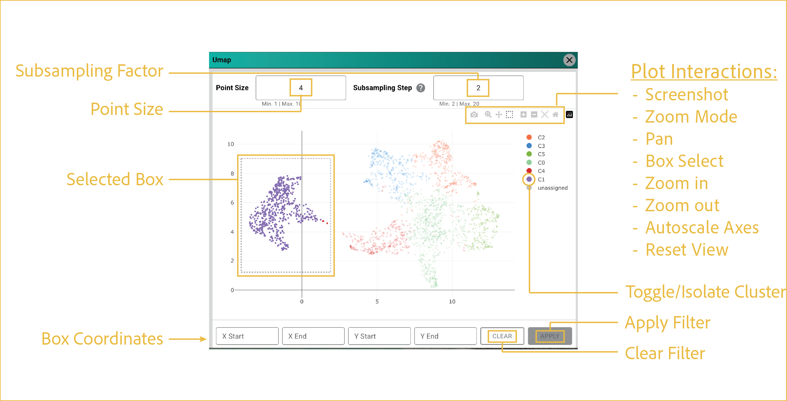

# UMAP filter

---

 

This section describes how to use the UMAP filtering tool to select and visualize cell populations based on their position within the UMAP embedding.

## reference image

 

The UMAP filter is displayed as a resizable pop-up window with its own set of interactive controls. Selected cell populations can be applied directly to the main viewer, allowing you to focus on specific regions of the UMAP embedding.

These controls configure the UMAP plot and apply selected cell populations back to the main viewer.

## features

- <b><u>Subsampling Factor:</u></b>

      Reduces the number of displayed points by the specified scale factor. Valid values range from **2** to **20**, with a default value of **2**.

- <b><u>Point Size:</u></b> 

      Manually adjust the size of displayed points by entering a floating-point value between **1** and **10**.

- <b><u>Plot Interactions:</u></b>

      This menu provides standard Plotly interactions. For filtering, the most important tool is **Box Select**, highlighted in the reference image. Use this tool to select a subpopulation of cells for downstream filtering.

      - **Screenshot:** Captures the displayed plot area without tools or other UI elements.
      - **Zoom Mode:** Allows dynamic scrolling to change the plot zoom level.
      - **Pan View:** Allows panning around the plot with your cursor.
      - **Box Select:** Selects cells to filter for segmentation display.
      - **Zoom In:** Zooms in at set intervals.
      - **Zoom Out:** Zooms out at set intervals.
      - **Autoscale Axes:** Autoscales axes to display all points in the viewing area.
      - **Reset View:** Returns to the default plot view.

- <b><u>Toggle/Isolate Clusters:</u></b>

      When using the **Box Select** tool to filter cells, these legend interactions can help refine the display:

      - **Single-click** a cluster to hide or show it.
      - **Double-click** a cluster to display only that cluster while hiding all others.

- <b><u>Selected Box:</u></b>

      After selecting the **Box Select** tool, left-click and drag to create a box around the cells you want to filter. This display shows an example selection on the UMAP embedding.

- <b><u>Box Coordinates:</u></b>

      These values describe the X and Y ranges of the box used for the filter. You can manually update these values if needed.

- <b><u>Apply/Clear Filter:</u></b>

      Once you are satisfied with your ROI selection, click **APPLY** to display the selected cells in the main viewer window.

      The filter remains active until you reopen the UMAP Filter tool and click **CLEAR**. UMAP filtering behaves like other segmentation filters and can be combined with other viewer filtering features.

 

--8<-- "_core/_partials/end_cap.md"
